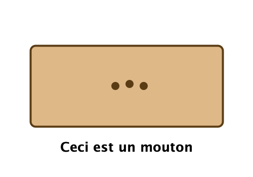

# TP APO : Encapsulation et graphes d'objets

## Introduction

Ce TP a pour objectif de vous faire découvrir les bases de la **programmation orientée objet** (POO) à travers un exemple concret : la représentation d'entiers relatifs avec leur décomposition en facteurs premiers.

Ce fichier "COMPTE_RENDU.md" vous permet de répondre aux questions ouvertes. Il est important pour votre "futur-vous", qui voudra réviser un TP dont il ne se souvient plus. Les enseignants pourront aussi, le cas échéant, le regarder et vous faire des retours sur son contenu.

Vous pouvez aussi y mettre toutes les questions/réfléxions que vous pouvez avoir au cours de ce TP, afin d'en avoir une trace qui vous permette, plus tard, de creuser le sujet encore plus en profondeur.

---

## Partie 1 : La classe `EntierRelatif`

### Exercice 1 : Une première classe d'objets

**1.a.** Identifiez les **attributs** de la classe et leur type. Quelle est leur visibilité (`public` ou `private`) ? Pourquoi choisit-on `private` plutôt que `public` pour les attributs ?

**_VOTRE RÉPONSE/VOS NOTES_**

**1.b.** La classe possède deux constructeurs. Expliquez le rôle de chacun. Que fait exactement le constructeur `EntierRelatif(EntierRelatif e)` ?

**_VOTRE RÉPONSE/VOS NOTES_**

**1.c.** Un **graphe d'objets** est un dessin qui représente les objets présents en mémoire à un instant donné, leurs attributs et les liens (flèches) entre eux. Dessinez sur papier le graphe d'objets correspondant à l'exécution du code suivant, juste après la deuxième ligne :

```java
EntierRelatif a = new EntierRelatif(12);
EntierRelatif b = new EntierRelatif(a);
```

**_VOUS POUVEZ PRENDRE VOTRE DESSIN EN PHOTO ET LE DEPOSER DANS VOTRE PROJET, puis l'inclure dans ce fichier en vous inspirant du lien ci-dessous._**



---

### Exercice 2 : Cohérence de l'état interne

**_NOTES ÉVENTUELLES_**

---

### Exercice 3 : Décomposition en facteurs premiers

**_NOTES ÉVENTUELLES_**

**3.a.** Pourquoi cette méthode doit-elle être `private` et non `public` ? Quel principe cela illustre-t-il ? Y a-t-il d'autres méthodes dans votre classe qui pourraient rester privées ?

**_RÉPONSES+NOTES ÉVENTUELLES SUR L'ENSEMBLE DE L'EXERCICE_**

---

### Exercice 4 : Le graphe d'objets revisité

**4.a.** Dessinez le graphe d'objets correspondant à l'exécution de :

```java
EntierRelatif a = new EntierRelatif(12);
```

**_VOUS POUVEZ PRENDRE VOTRE DESSIN EN PHOTO ET LE DEPOSER DANS VOTRE PROJET, puis l'inclure dans ce fichier en vous inspirant du lien ci-dessous._**


**_RÉPONSES+NOTES ÉVENTUELLES SUR L'ENSEMBLE DE LA QUESTION_**

**4.b.** Dessinez maintenant le graphe d'objets après l'ajout de :

```java
EntierRelatif b = new EntierRelatif(a);
```

**_VOUS POUVEZ PRENDRE VOTRE DESSIN EN PHOTO ET LE DEPOSER DANS VOTRE PROJET, puis l'inclure dans ce fichier en vous inspirant du lien ci-dessous._**


**_RÉPONSES+NOTES ÉVENTUELLES SUR L'ENSEMBLE DE LA QUESTION_**

---

### Exercice 5 : Le piège du getter

**_RÉPONSES+NOTES ÉVENTUELLES SUR L'ENSEMBLE DE L'EXERCICE_**

--- 

### Exercice 6 : Le piège du setter

**_RÉPONSES+NOTES ÉVENTUELLES SUR L'ENSEMBLE DE L'EXERCICE_**

---

### Exercice 7 : Le piège du constructeur qui copie un autre `EntierRelatif`

**_RÉPONSES+NOTES ÉVENTUELLES SUR L'ENSEMBLE DE L'EXERCICE_**

**NOTE:** lorsqu'on vous demande un code comme cela (qui vérifie quelque chose), vous pouvez en faire un test (en vous inspirant des classes de test fournies dans le projet)

---

### Exercice 8 : Évaluation paresseuse

**_RÉPONSES+NOTES ÉVENTUELLES SUR L'ENSEMBLE DE L'EXERCICE_**


---

### Exercice 9 : Représentations textuelles et évaluation paresseuse symétrique

**_RÉPONSES+NOTES ÉVENTUELLES SUR L'ENSEMBLE DE L'EXERCICE_**
    

## Partie 2 : La classe `Rationnel`


### Exercice 10 : Corriger la classe `Rationnel`

**_RÉPONSES+NOTES ÉVENTUELLES SUR L'ENSEMBLE DE L'EXERCICE_**

---

### Exercice 11 : Représentations textuelles de `Rationnel`

**_RÉPONSES+NOTES ÉVENTUELLES SUR L'ENSEMBLE DE L'EXERCICE_**

